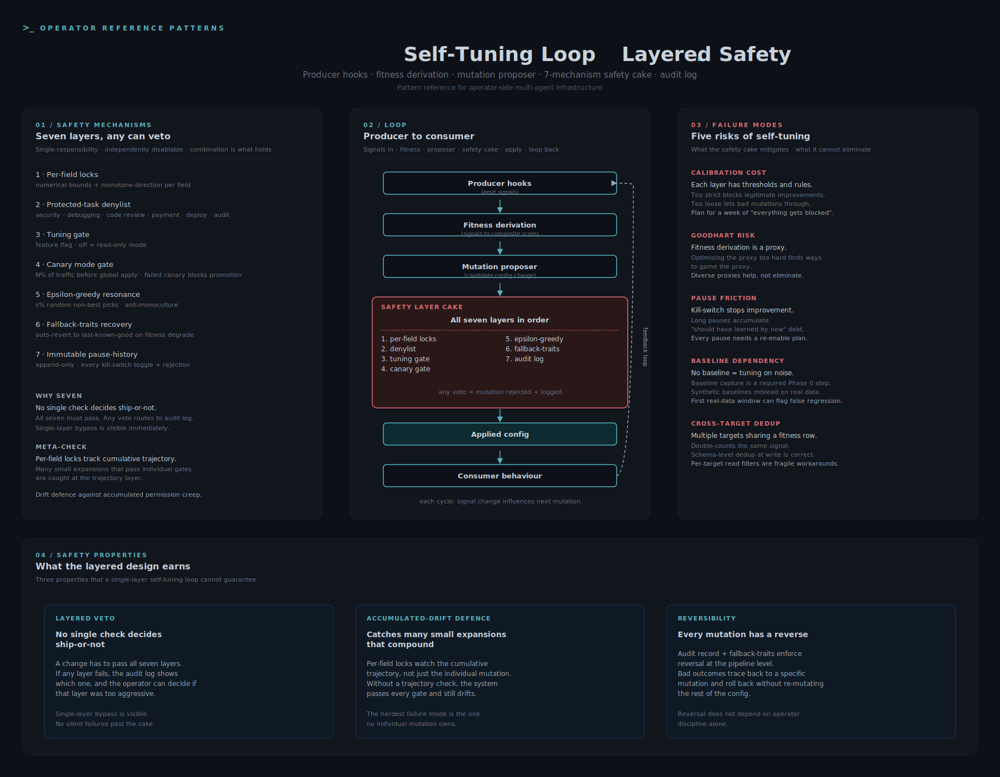

# Self-Tuning Loop with Layered Safety



A reference pattern for letting a multi-agent system tune its own configuration over time, with seven specific defense-in-depth mechanisms against accumulated drift.

## The operator-side problem

Multi-agent systems have configurable behaviour: routing thresholds, personality traits, denylists, retry policies, exploration rates. Hand-tuning is slow and biased; ignoring leaves performance on the table. The instinct is to let the system tune itself based on observed outcomes.

That instinct is dangerous without guardrails. A self-tuning loop without safety layers will eventually:
- Drift its policy envelope into territory the operator never sanctioned
- Reward proxy metrics (engagement, completion rate) that diverge from real value
- Quietly remove safety constraints because they hurt the short-term metric
- Accumulate small permission expansions that compound into a large one

Operators need a self-tuning loop that improves observable behaviour while making it impossible (or at least hard) for the loop to corrode the safety floor.

## The seven safety mechanisms

Each mechanism is single-responsibility and independently disablable. The combination is what holds.

| Mechanism | What it gates |
|---|---|
| **Per-field locks with thresholds** | Each tunable config field has numerical bounds and a monotone-direction constraint. Mutation outside bounds is rejected. |
| **Denylist of protected task types** | A fixed set of task categories (security, debugging, code review, payment, deploy, audit, and similar) where the loop never proposes changes. |
| **Tuning gate** | A feature flag for the whole loop. Off = the loop runs in read-only mode (observes but never proposes). |
| **Canary mode gate** | When on, every proposed mutation is tested on N% of traffic before global apply. Failed canaries do not promote. |
| **Epsilon-greedy stochastic resonance** | ε% of routing picks are random non-best choices. Prevents the loop from collapsing into a monoculture on a local optimum. |
| **Fallback-traits recovery** | If a mutation degrades fitness, auto-revert to last-known-good. Limits how far a bad mutation can propagate before reversal. |
| **Immutable pause-history audit log** | Append-only record of every kill-switch toggle and every safety-layer rejection. Cannot be deleted by the loop itself. |

## The pattern

```
Producer hooks  ->  Fitness derivation  ->  Mutation proposer
                                                  |
                                                  v
                                    +-------------------------+
                                    | Safety layer cake       |
                                    | 1. per-field locks      |
                                    | 2. denylist             |
                                    | 3. tuning gate          |
                                    | 4. canary gate          |
                                    | 5. epsilon-greedy       |
                                    | 6. fallback-traits      |
                                    | 7. audit log            |
                                    | Each layer can veto.    |
                                    | Failures route to audit.|
                                    +-------------------------+
                                                  |
                                                  v
                                          Applied config
                                                  |
                                                  v
                                        Consumer behaviour
                                                  |
                                                  v
                                        (back to producer)
```

Producer hooks emit signals (success rates, correction rates, latency). Fitness derivation turns signals into a composite score with explicit weights. The mutation proposer generates a candidate change. The safety cake reviews. If applied, the change shapes consumer behaviour, which feeds back into producer signals for the next cycle.

## Three safety-relevant properties

**Layered veto.** No single check decides ship-or-not. A change has to pass all seven layers. If any layer fails, the operator sees the rejected mutation in the audit log and can decide whether the layer was too aggressive or the mutation was genuinely bad. Single-layer bypasses are visible.

**Accumulated-drift defence.** The hardest failure mode is many small permission expansions that each look fine. The meta-check / per-field-lock layer specifically watches the cumulative trajectory of mutations, not just the individual one. Without a cumulative check, the system passes every individual gate and still drifts over a hundred mutations.

**Reversibility.** Every applied mutation has an audit record and a reverse. Bad outcomes downstream can be traced back to a specific mutation and rolled back without re-mutating the rest. The fallback-traits layer enforces this at the mutation-pipeline level so it does not depend on operator discipline.

## Trade-offs and limits

**Calibration cost.** Each layer has thresholds and rules. Setting them too strict blocks legitimate improvements; too loose lets bad mutations through. Calibration is iterative and requires operator attention, especially in the first weeks of operation. Plan for a week of "everything gets blocked" before the thresholds stabilise.

**Goodhart risk.** Fitness derivation is a proxy for the real outcome. Optimising the proxy too hard finds ways to game the proxy. Diverse proxies and skeptical interpretation help; eliminating the risk is not possible inside the loop itself.

**Pause friction.** When the operator pauses the loop (kill-switch on), the system stops improving. Long pauses accumulate "should have learned this by now" debt. Pausing is correct when something is wrong, but every pause needs a re-enable plan or it becomes a permanent off.

**Baseline dependency.** A self-tuning loop without a real baseline is tuning on noise. The pattern requires a baseline capture step (often skipped in initial implementations) before any mutation should ship. Synthetic baselines produce misleading regression signals on first real-data contact.

**Cross-target dedup.** If multiple mutation targets share a fitness row, the loop double-counts the same signal. Schema-level dedup at the row write is the correct place to fix this; per-target filters at read time are fragile.

## Application to operator-side multi-agent safety

This is the pattern the grant proposes to package as one of two open-source primitives. The argument: most multi-agent operators will reach for some form of self-tuning, and most will under-build the safety layers because the short-term incentive is performance. Shipping a reference implementation with all seven mechanisms baked in raises the floor of what operators ship by default.

The trade-off operators must accept: the layered-safety version of self-tuning is slower to improve than the un-gated version. That trade is the point.
