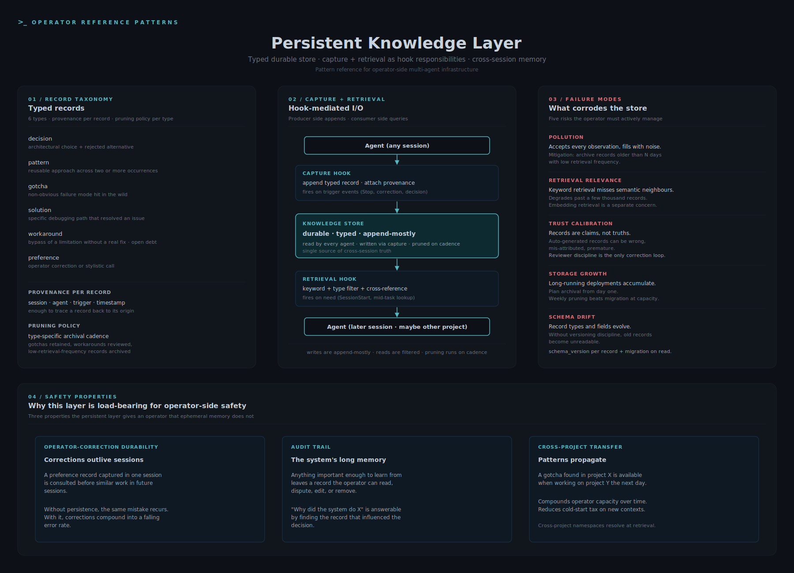

# Persistent Knowledge Layer



A reference pattern for a session-spanning typed knowledge store shared across the agents in a multi-agent system, with capture and retrieval as first-class hook responsibilities.

## The operator-side problem

Multi-agent systems forget. Each agent invocation starts fresh, with whatever context the orchestrator passes in. That works for short tasks but breaks down as soon as:
- A decision from a past session should influence the current one
- A correction the operator made yesterday should not need to be made again today
- A pattern recognised in one project should be available to a different project
- An incident from last week should inform the next response, not be re-discovered

Operators need a layer that persists across sessions, agents, and projects, and that is both readable on demand (retrieval) and writeable on the fly (capture). Frameworks usually give per-session memory; the gap is durable, structured, cross-session memory with a typed record model.

## Record taxonomy

The store is not a free-text dump. Records are typed; the type determines retrieval semantics and pruning policy.

| Type | Captured when | Retrieval use |
|---|---|---|
| `decision` | An architectural choice was made and a different choice was rejected | Avoid re-litigating the same trade-off |
| `pattern` | A reusable approach was recognised across two or more occurrences | Apply the same approach in a new context |
| `gotcha` | A non-obvious failure mode was hit | Avoid the same failure mode in a different agent |
| `solution` | A specific debugging path resolved an issue | Recreate the resolution on recurrence |
| `workaround` | A limitation was bypassed without a real fix | Track the open debt; do not lose the bypass |
| `preference` | An operator correction or stylistic call | Apply consistently across future sessions |

Each record carries provenance (which session, which agent, which trigger caused capture) and a soft type signal that retrieval can filter on.

## The pattern

```
Agent (any session)
       |
       v
  Capture hook  ->  appends typed record + provenance
       |
       v
  Knowledge Store (durable, typed, append-mostly)
       ^
       |
  Retrieval hook  <-  keyword + type filter + optional cross-reference
       ^
       |
Agent (later session, possibly different project)
```

Writes are append-mostly with occasional pruning. Reads are keyword-based with optional structured filters. The store sits behind an interface every agent in the system can read and write through.

## Three safety-relevant properties

**Operator-correction durability.** When an operator corrects an agent, the correction needs to outlive the session. Without persistent capture, the same mistake recurs forever. With it, the population of corrections compounds into a falling error rate. The mechanism: each `preference`-type record is consulted before similar work in future sessions.

**Audit trail.** The store is the system's long memory. Anything important enough to learn from leaves a record that the operator can read, dispute, edit, or remove later. Behaviour is reviewable after the fact. A reviewer can ask "why did the system do X" and find the record that influenced the decision.

**Cross-project transfer.** Patterns recognised in one project propagate to others through retrieval. A gotcha found while debugging component A in project X is available when working on component B in project Y the next day. This compounds operator capacity over time and reduces the cold-start tax on new contexts.

## Trade-offs and limits

**Pollution risk.** A store that accepts every observation eventually fills with low-value noise. The pattern needs an explicit promotion / pruning discipline or the signal-to-noise ratio decays. Concrete mitigation: archive records older than N days with low retrieval-frequency, retain those that were retrieved-and-applied.

**Retrieval relevance.** Keyword retrieval misses semantically related records that don't share vocabulary. The pattern degrades as the store grows past a few thousand records; embedding-based retrieval becomes a separate concern. Operators should expect to read the store directly sometimes, not only query it.

**Trust calibration.** Records are claims, not truths. The system writes them; the operator reviews them. An auto-generated decision record might be wrong, mis-attributed, or premature. The capture pattern does not validate, it only persists. Reviewer discipline is the only correction loop.

**Storage growth.** Long-running deployments accumulate. Plan for archival from day one, not as a retrofit. A pruning script that runs weekly is cheaper than a database migration when the store exceeds capacity.

**Schema drift.** Record types and fields evolve. Without a versioning discipline, old records become unreadable. A simple `schema_version` field per record and a migration path on read prevents the slow corrosion.

## Application to operator-side multi-agent safety

The persistent knowledge layer is where corrections become permanent. A drift detector observes drift; the knowledge layer is where the observation is stored and where future sessions read it before repeating the behaviour. Drift detection without persistent capture is observation without memory.

For operators choosing whether to add this layer: the question is not "do we need persistent memory" (the answer is yes for any deployment longer than one session) but "what record types are worth keeping and what discipline keeps the store useful." That discipline is the operator's; the pattern is the substrate.
