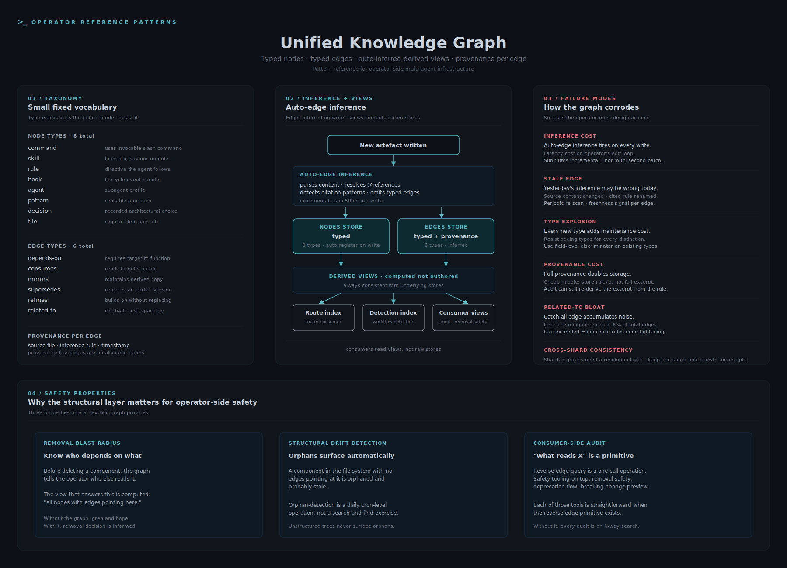

# Unified Knowledge Graph



A reference pattern for storing the relationships between the knowledge atoms in a multi-agent system, with typed nodes, typed edges, and auto-inferred derived views.

## The operator-side problem

A multi-agent system accumulates artefacts: commands, skills, rules, hooks, agents, patterns, decisions, files. Each artefact has dependencies and consumers. As the system grows past a small handful of components, the dependency surface stops fitting in the operator's head.

Without an explicit graph:
- Removing a component breaks consumers the operator did not know existed
- Changing a rule affects routes that nobody traced
- A new pattern looks novel because the related-prior-pattern is buried
- Audit becomes guess-and-check: did I find every consumer of this thing
- Orphan components accumulate (exist in the file tree, no edges pointing at them)

Operators need a structured graph of the system's own internal relationships, kept fresh enough to be trustworthy.

## Node and edge taxonomy

A small fixed vocabulary. Type-explosion is a real risk; resist it.

**Node types (8):**

| Type | What it represents |
|---|---|
| `command` | A user-invocable slash command |
| `skill` | A loaded behaviour module |
| `rule` | A directive the agent follows |
| `hook` | A lifecycle-event handler |
| `agent` | A subagent profile |
| `pattern` | A reusable approach |
| `decision` | A recorded architectural choice |
| `file` | A regular file (catch-all) |

**Edge types (6):**

| Type | Meaning |
|---|---|
| `depends-on` | Requires the target to function |
| `consumes` | Reads the target's output |
| `mirrors` | Maintains a derived copy |
| `supersedes` | Replaces an earlier version |
| `refines` | Builds on without replacing |
| `related-to` | Catch-all weak relation (use sparingly) |

Each edge carries provenance: which file or content excerpt led to the inference, which inference rule fired, when it was inferred. Provenance-less edges are unfalsifiable claims.

## The pattern

```
New artefact written
       |
       v
Auto-edge inference  ->  parses content
       |                  resolves @references
       v                  detects citation patterns
   +---------+----------+
   |                    |
   v                    v
Nodes store          Edges store
(typed)              (typed, with provenance)
   |                    |
   v                    v
  +---------------------+
              |
              v
  Derived views (computed, not authored)
  - Route index (router consumer)
  - Detection index (workflow detection)
  - Consumer views (audit, removal safety)
```

Nodes auto-register on first write. Edges are inferred from content via a small set of rules (explicit @references, file imports, rule citations, command invocations). Derived views are computed; consumers read the views, not the raw stores. This keeps the views always-consistent with the underlying graph.

## Three safety-relevant properties

**Removal-blast-radius.** Before deleting a component, the graph tells the operator who else reads it. Removals without consulting the graph break things; with the graph, the operator either updates consumers first or decides the deletion is unsafe. The view that answers this is computed: "all nodes with edges pointing at the candidate-for-deletion."

**Drift detection at the structural level.** If a component exists in the file system but has no edges, it is orphaned and probably stale. The graph surfaces orphans automatically, where an unstructured file tree never does. An orphan-detection pass is a daily cron-job-level operation, not a search-and-find exercise.

**Consumer-side audit.** When an operator asks "what reads X," the graph answers. Without the graph, the answer is grep-and-hope. The reverse-edge query is a primitive; building safety tooling on top of it (removal safety, deprecation flow, breaking-change preview) is straightforward.

## Trade-offs and limits

**Inference cost.** Auto-edge inference runs on every artefact write. The cost shows up as latency on the operator's edit loop unless inference is incremental and indexed. Plan for sub-50ms per write, not multi-second batch jobs.

**Stale-edge risk.** Edges inferred yesterday may be wrong today (the source content changed, the cited rule was renamed). The pattern needs a periodic re-scan or a freshness signal on each edge; otherwise the graph slowly fictionalises.

**Type-explosion.** Every new node type or edge type adds maintenance cost. The vocabulary above is intentionally small. Resist the urge to add a type for every distinction; use existing types with a field-level discriminator instead.

**Provenance vs. cost.** Storing full provenance per edge doubles the storage. Storing only a provenance-rule-id (which rule fired) instead of the full excerpt is the cheap middle ground.

**Edge-type weighting.** `related-to` is a catch-all that accumulates noise. Concrete mitigation: cap `related-to` at N% of total edges; if the cap is exceeded, the inference rules need tightening.

**Cross-shard consistency.** If the graph is sharded across namespaces (per project, per scenario), references that cross shards need a separate resolution layer. The simple version is to keep the graph in one shard until growth forces the split.

## Application to operator-side multi-agent safety

The graph is where structural reasoning lives. It is the data layer behind drift detectors that ask "is this component still alive?" and removal-safety tools that ask "what depends on this?" Without the graph, drift detection is one-component-at-a-time; with it, drift detection is structural.

For operators choosing whether to build this layer: the question is whether the system is small enough to hold in the operator's head. If yes, the graph is over-engineering. If no, the graph is the substrate on which most other audit and safety tooling will end up depending. The transition from "small enough" to "not small enough" is usually invisible until something breaks; building the graph before that point is cheaper than retrofitting after.
